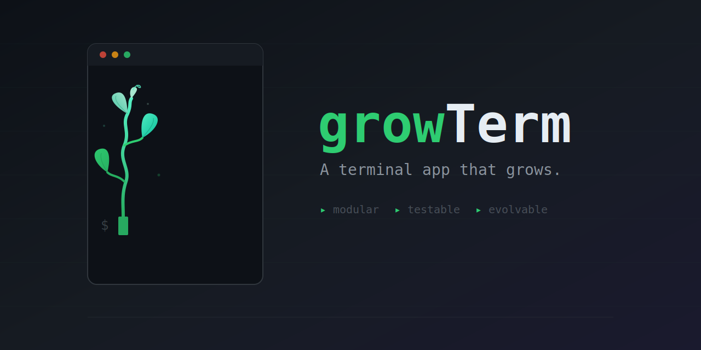

<p align="center">
  
</p>

[한국어](README.ko.md)

A GPU-accelerated terminal emulator written in Rust. macOS support.

## Design Goals

Build a structure where code changes can be **quickly verified with tests**.

- **Encapsulation**: You don't need to know the VT parser to fix clipboard copy. Each module can be modified knowing only its own responsibility.
- **Testing**: Pure functions and state machines are verified with unit tests; module interactions with integration tests.

## Features

- **GPU Rendering** — wgpu-based 2-pass rendering (background + glyphs)
- **Korean Support** — IME input, wide character handling, D2Coding font
- **VT Parsing** — SGR attributes, 256/RGB color, cursor movement, screen clearing
- **Mouse Selection & Clipboard** — Drag selection, Cmd+C/V
- **Font Zoom** — Cmd+=/- to adjust size
- **Block/Box Drawing Characters** — Geometric rendering

## Architecture

```
Key Input → Input Encoding → PTY
                              ↓
                           VT Parser
                              ↓
                             Grid
                              ↓
                        Render Commands
                              ↓
                         GPU Rendering → Screen
```

| Module | Role |
|---|---|
| Shared Types | Cell, Color, RenderCommand, etc. |
| VT Parser | VT100/xterm escape sequence parsing |
| Grid | Terminal grid state management |
| Render Commands | Grid → Render command conversion |
| GPU Rendering | wgpu-based screen output |
| Input Encoding | Key input → PTY byte conversion |
| PTY | Shell process management |
| App | Event loop, module integration |

## Build & Run

```bash
cargo build --release
cargo run -p growterm-app
```

## Test

```bash
cargo test
```

314 tests (unit + integration).

## Requirements

- Rust (stable)
- macOS (wgpu Metal backend)
